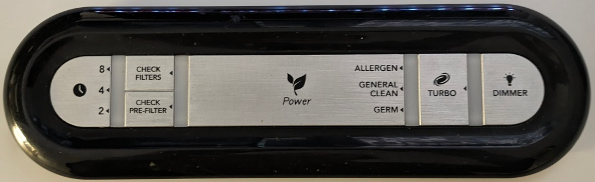
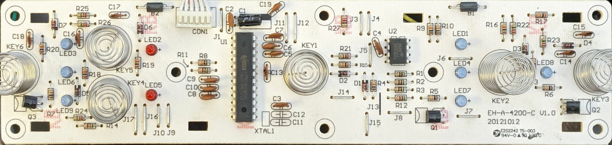

ESPHome replacement control board for Honeywell True HEPA Air Purifier.

*Not tested yet*, but designed to be compatible with HPA200. I expect it to also
be compatible with the HPA300 and HPA100.

This is a replacement for EH-A-4200-C V1.00, designed 2012-10-12.

## BOM

### Desoldered from original

- 7x touchpad springs
- 1x cable assembly

### Hand-soldered

- 1x [D1 mini ESP32](https://github.com/r0oland/ESP32_mini_KiCad_Library)
- 1x 16V+, 100uF+, P=3.5mm through-hole capacitor (probably optional)
- 4x 10-pin 2.54mm headers. 2x of these generally come with your D1 mini ESP32 kit, and you can likely repurpose the long female headers from the kit as the other 2x.

### SMD

- 5x 16V+, 1uF+, 0805 ceramic capacitor
- 10x SKC6812 LEDs
- 1x M7 SMA diode

## Installation

### Tools

1. T20 security bit, 2in long
2. Philips #2 screwdriver
3. Spudger or flathead screwdriver
4. Soldering iron
5. Soldering wick
6. Solder

### Procedure

1. Unplug the unit from the wall. If you do not do this, there is a high risk of electric shock.
1. Remove the filter grill from the front of the device by pressing it inwards
1. 6 screw holes will be revealed on the sides of the unit. 2 of the screws were T20 security screws, and the other 4 were #2 philips. Unscrew these screws.
1. The top of the unit still has four clips holding the front on. Use a spudger to release the top clips on the front side.
1. Remove the front panel of the unit.
1. 4 smaller philips screws will be revealed holding the top on. Unscrew these.
1. Use a spudger to release the top clips on the back side.
1. The top panel should easily come off.
1. Unscrew the screws holding the controls tray.
1. Unscrew the screws holding the control PCB.
1. Release the clips holding the control PCB in.
1. Unplug the control cable assembly from the power supply board.
1. Use the soldering iron and solder wick to remove the touchpad springs and the cable assembly.
1. Solder the touchpad springs on the top side of the replacement control board. This is the side of the control board with the LEDs.
1. Solder the cable assembly on the top side of the replacement control board.
1. Solder the D1 mini ESP32 on the reverse of the replacement control board, using the silk-screen outline as a guide.
1. Flash the D1 mini ESP32 with ESPHome via the USB port.
1. Reverse steps to re-assemble.

## Software

Not yet implemented. https://www.reddit.com/r/Esphome/comments/175oevr/can_i_make_this_filtrete_air_purifier_smart/k4r254h/ looks like a good starting point.

## Credits

- Thank you to [Keith Burzinski](https://github.com/kbx81) for reviewing my design through endless revisions!
