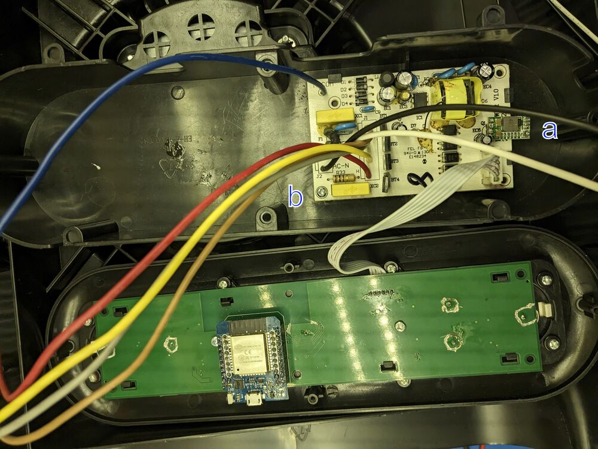
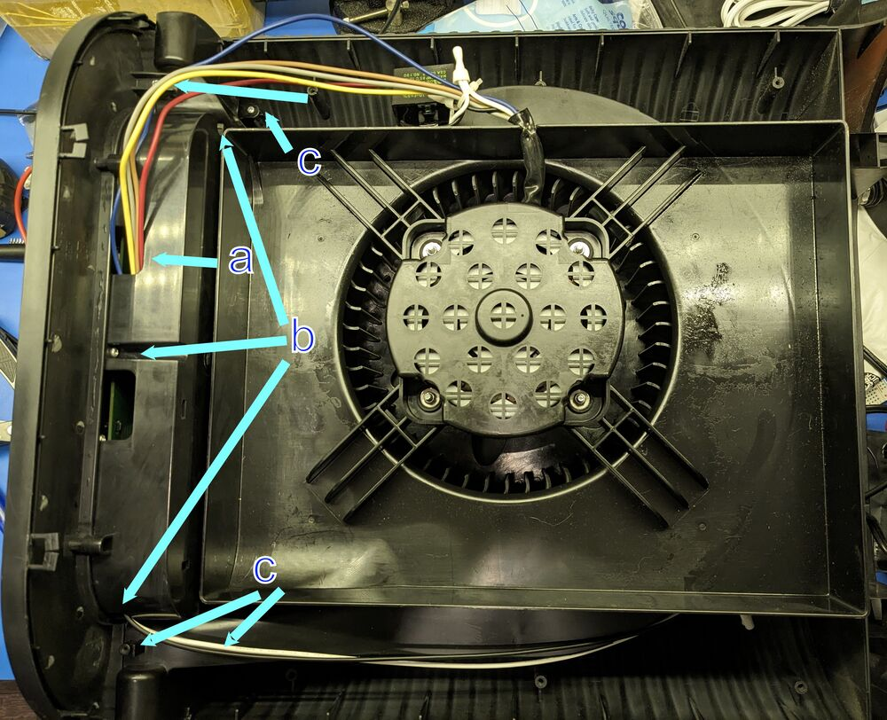
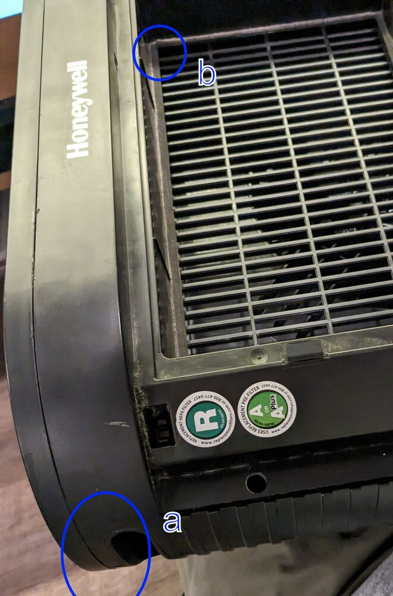

# ESPHome replacement control board for Honeywell True HEPA Air Purifier.

[demo](docs\demo.mp4) of older firmware version, need to update
## Current Software Features
Currently the on device firmware recreates all of the factory features of the HPA200 with a few improvements. Connection to Home Assistant is not needed for any functions.
- Fan Speed
  - Pressing the power button will toggle thru the 4 fan speed and then off
  - Turbo button will go to highest fan speed immediately
- Timer
  - Pressing the "Clock" button will toggle thru 2, 4, 8hr run timers
- Filter buttons
  - Current filter life is now show constantly with the LEDs next to the respective buttons. Used life is indicated by color gradient green-yellow-red
  - Filter lifetime hours is configurable in firmware or via Home Assistant
  - Filter usage can be reset by long holding the respective "Check filter" button for 3 seconds
- Dimmer
  - Dimmer setting is now retained even when unplugged. Pressing the dimmer button will cycle between LED levels down to 0%. Pressing any UI button will change all LEDs to max brightness and then they will return to their dimmed values after 5 seconds.
- Home Assistant
  - The fan speed is exposed as a variable speed fan
  - The accumulated filter and prefilter hours are exposed as sensors
  - The filter lifetime values are exposed as Configuration numbers. This allows customization of these values via HA without changes to the firmware.

## Compatibility and Hardware Versions
Compatible with HPA200. It *is not* compatible with the HPA300 or HPA100. The repo title mentioning "HPAx00" is **incorrect**, only the HPA200 will work. The specific PCB design you see in this repo has only been tested in a V2 unit, but is expected to work in V1 units without issue.

I suggest checking compatibility by disassembling your unit and confirming the control panel looks similar and is 205mm between the two furthest apart touch button pads.

### HPA200 Internal PCB Versions
There are two known versions of the the HPA200 internal PCBs V1 and V2. The replacement control PCB is compatible with both of these versions however only the V1 units will need modifications to the power PCB mentioned below.

#### Version 1
EH-A-4200-C V1.00, designed 2012-10-12.

#### Version 2
EH-A-4200V2-C-V1.0, designed 2019-06-04

## BOM

### Desoldered from original

- 7x touchpad springs
- 1x cable assembly

### Hand-soldered on Control PCB

- 1x [D1 mini ESP32](https://github.com/r0oland/ESP32_mini_KiCad_Library) (Note: this is the 40 pin ESP32 D1 NOT the 20 pin ESP8266 D1 Mini, I used https://www.aliexpress.us/item/2251832671740023.html, "CH9102X drive")
- 1x 6.3V+, 100uF+, P=3.5mm through-hole capacitor (probably optional but needs to be installed on it's side on the top of the PCB or vertical on the bottom due to housing clearance)
- 4x 10-pin 2.54mm headers. 2x of these generally come with your D1 mini ESP32 kit, and you can likely repurpose the long female headers from the kit as the other 2x.

### SMD for Control PCB

- 5x 16V+, 1uF+, 0805 ceramic capacitor
- 10x SKC6812 LEDs
- 1x M7 SMA diode

### Power PCB

There V1 power PCB can not supply enough 5VDC for the ESP and new LEDs. Replacement of the 7805 linear voltage regulator with a modern switched power supply is required.
- 7805-compatible buck regulator module
  - First prototype used https://www.aliexpress.us/item/3256801422436146.html which is no longer listed
  - Currently listed equivalent https://www.aliexpress.us/item/3256807692095306.html
  - Or drop in 7805 replacement IC like this https://www.digikey.com/en/products/detail/xp-power/RBT05W24S05/26667098

The V2 Power PCB has a new 5V power supply that has enough power to support the new control board and no modifications are required.
#### Power PCB Version Images
V1 Power PCB

V2 Power PCB

## Installation

### PCB Ordering

To the right of this page is the releases area. This area contains all the
materials you need to order your PCB from your preferred board house. I used
JLCPCB, so that is likely easiest, especially if you'd prefer someone else to
do the SMD assembly.

Hand placed SMD and hotplate reflow is also possible. Here is a list of SMD parts from Digikey available as of 2025 Q4. Note these LEDs vary slightly from the ones in the JLC BOM and require a code change.
| Item | DK PN | Qty |
|----------|----------|----------|
| CAP CER 4.7UF 25V X5R 0805   | [1276-1244-1-ND](https://www.digikey.com/en/products/detail/samsung-electro-mechanics/CL21A475KAQNNNE/3886902)     | 5     |
| ADDRESS LED DISC SERIAL RGB 1=10    | [1528-1104-ND](https://www.digikey.com/en/products/detail/adafruit-industries-llc/1655/5154679)     | 10     |
| DIODE STANDARD 1000V 1A DO214AC    | [5399-M7CT-ND](https://www.digikey.com/en/products/detail/shenzhen-slkormicro-semicon-co-ltd/M7/21853078)     | 1     |
| CAP ALUM 100UF 20% 16V RADIAL TH | [UVP1C101MPD1TD](https://www.digikey.com/en/products/detail/nichicon/UVP1C101MPD1TD/4328297)     | 1     |

### Tools

1. T20 TORX bit, 2in long (V2 units require T20 pin in head security bit)
1. Philips #2 screwdriver
1. Spudger or flathead screwdriver
1. Soldering iron
1. Soldering wick
1. Solder

### Procedure

#### Disassembly

1. Unplug the unit from the wall. If you do not do this, there is a high risk of electric shock.
1. Remove the filter grill from the front of the device by pressing it inwards
1. 6 screw holes will be revealed on the sides of the unit, Unscrew these screws.
    * V1 - 2 of the screws were T20 screws, and the other 4 were #2 philips.
    * V2 - all screws are T20 pin in head security bit
1. The top of the unit still has four clips holding the front on. Use a spudger to release the top clips on the front side.
1. Remove the front panel of the unit.
1. 4 smaller philips screws will be revealed holding the top on. Unscrew these.
1. Use a spudger to release the top clips on the back side.
1. The top panel should easily come off.
1. Unscrew the screws holding the controls tray.
1. Unscrew the screws holding the control PCB.
1. Release the clips holding the control PCB in.
1. Unplug the control cable assembly from the power supply board.
1. Use the soldering iron and solder wick to remove the touchpad springs and the cable assembly.

#### Modifications

**Figure 1:**

1. Flash the D1 mini ESP32 with ESPHome via the USB port. See the config at [HPA200_HEPA_Filter_V2.yaml](HPA200_HEPA_Filter_V2.yaml) as a starting point.
1. Solder the touchpad springs on the top side of the replacement control board. This is the side of the control board with the LEDs.
1. Solder the cable assembly on the top side of the replacement control board.
1. Solder the D1 mini ESP32 on the reverse of the replacement control board, using the silk-screen outline as a guide.
1. **V1 Power supply boards only:** De-solder Q1 from the power-supply board. Replace it with a 7805-compatible buck regulator. The output pin is the one closest to the connector. (see Fig 1, a)
1. Re-install the power supply board. Note that the screw is flat-tipped and shorter than the others (Fig 1, b)
1. Insert the board into the control panel and reinstall all screws.

#### Re-assembly

**Figure 2:**

**Figure 3:**

Reverse steps to re-assemble. Some notes:

1. Make sure the motor wires are coming out of the hole indicated in Fig 2, a
1. First screw the electronics box to the lid (Fig 2, b)
1. Then screw the lid onto the rest of the unit (Fig 2, c)
1. When snapping the front of the device on, make sure the plastic next to the handle (Fig 3, a) is correctly snapped in on both sides

## Software

See the config at [hepa-filter.yaml](./hepa-filter.yaml) as a starting point. You will need to use ESP32 Touch Pad's `setup_mode` to calibrate touch thresholds for each unit variance between units can be large.

## Credits

- Thank you to [Keith Burzinski](https://github.com/kbx81) for reviewing my design through endless revisions!

